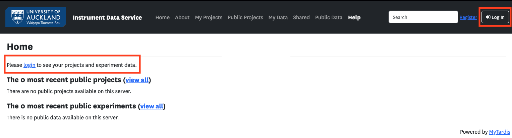
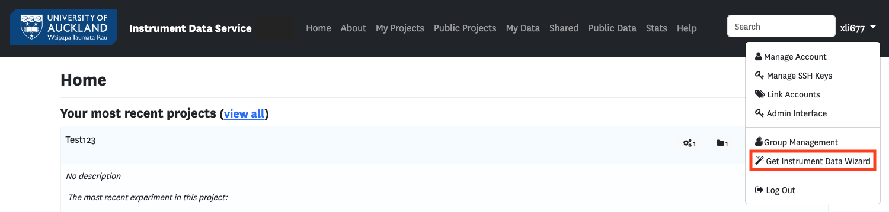
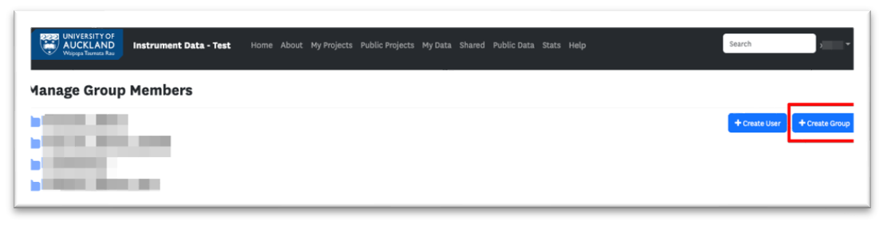
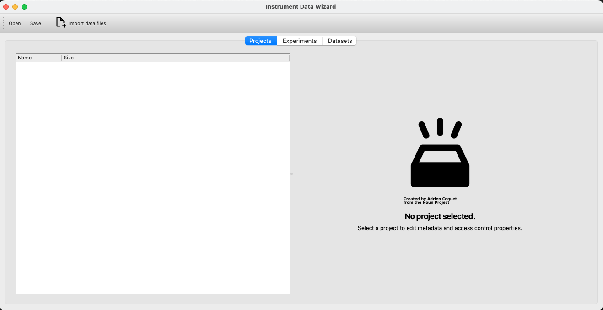
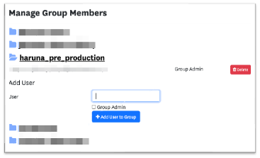
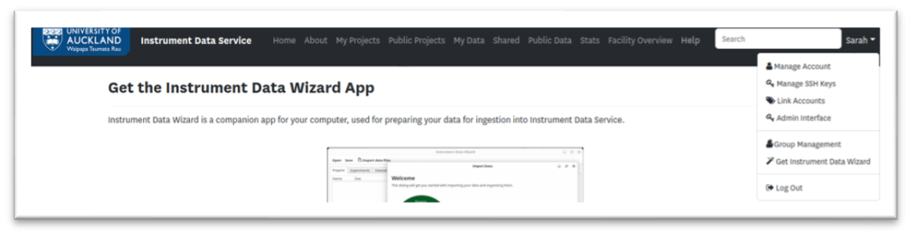
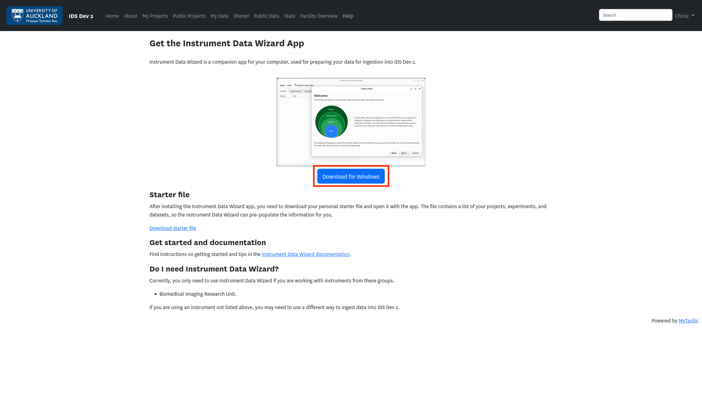
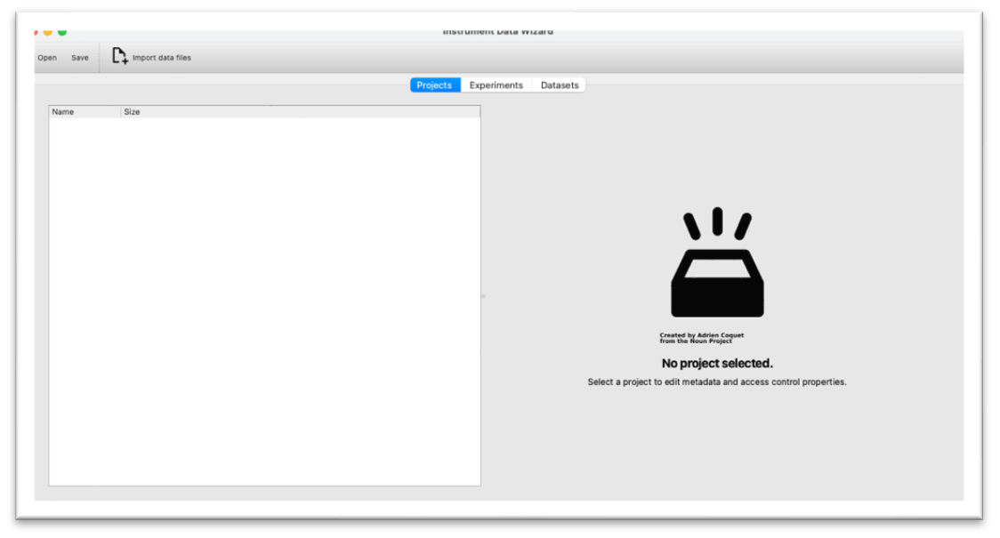
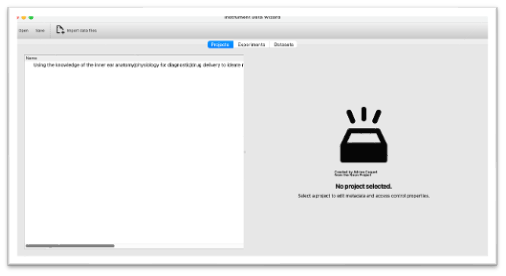
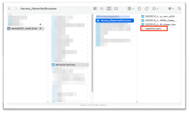

Instructions for Using the Test Instrument Data Service (IDS)
==============================================================

This document provides step-by-step instructions for using the Test Instrument Data Service (IDS).

Log in to the Test IDS
---------------------------------------------------

`Test Instrument Data Service (IDS) <https://test-instruments.nectar.auckland.ac.nz/>`_

- **Step 1:** Click "**Log In**" on the login page.

- **Step 2:** Complete the 2FA authentication.

  .. note::

    This is the UoA test infrastructure. Even if you regularly use 2FA, this system is different. You likely do not have a test account unless you have previously used IDS or other new software. There is no option to register for a test account directly; instead, click "**I've forgotten my password**" to create your account.

- **If you have a registered test account:**
  
  - **Step 3:** Enter your username and password.

  .. image:: instruction2.png
  
- **If you don’t have a test account:**
  
  - **Step 3:** Click "**I've forgotten my password**".

  .. image:: instruction3.png

  - **Step 4:** Click "**Reset Password**" to reset the password.

  .. image:: instruction4.png

  - **Step 5:** Set up your token.
  
    - Click "**I don’t have a token**".
      
      .. note::

        If you're repeatedly redirected to the login page, contact the Staff Service Centre at ext 86000 or (09) 923 6000 to reset the token.

    .. image:: instruction5.png
    
    - Choose "**Software**" to "**create a New Token**".

    .. image:: instruction6.png
  
    - Follow the steps to create and verify the token.

    .. image:: instruction7.png

    .. note::

      Ensure you "**Verify and save**" the token.

Set up New Groups
---------------------

- **Step 1:** Once logged in, click your username in the top-right corner and select "**Group Management**", or go directly to the `Group Management page <https://test-instruments.nectar.auckland.ac.nz/group/groups/>`_ to set up new groups.

- **Step 2:** Click "**Create group**".

- **Step 3:** Enter the group name and the UPI of the group admin to create the group.

  .. note::

    You'll use the group name in the Instrument Data Wizard.

- **Step 4:** Add users to the group now or later as needed.

Download and Install the App
--------------------------------

- **Step 1:** Click your username in the top-right corner and select "**Get Instrument Data Wizard**".

- **Step 2:** Download the app for your operating system.

- **Step 3:** Run the app.
  
  - Unzip the downloaded file.
  - Put the `.exe` in a convenient location where you can easily find it, such as "My Documents".
  
  .. note::

    Admin rights are not required.

Organize Your Data
----------------------

- **Step 1:** Open the app.

  .. note::

    Your device needs **Java** installed for the automated metadata extraction feature to work. Please ensure a **Java JDK** is installed on your system. For Windows, search and install '**Corretto OpenJDK**' from the Software Centre.

  
- **Step 2:** Start adding projects, experiments, datasets, and files.

  .. note::

    If you are not familiar with Instrument Data Wizard, please follow the :ref: `../tutorial` for guidance.

Save Your Data
------------------

- **Step 1:** Once you have added all your data, save the ingestion file in the root of your data folder on the BIRU shared drive.

Notify Us
-------------

- **Step 1:** Inform us and provide the data location via email to |service_contact|.
  
  **Example of the data location:**

  - **For Windows:** ``\\files.auckland.ac.nz\research\resmed202000005-biru-shared-drive\<your-root-folder>``
  - **For Linux and Mac:** ``//files.auckland.ac.nz/research/resmed202000005-biru-shared-drive/<your-root-folder>``
  
- **Contact:** |service_contact| for assistance with IDS setup.