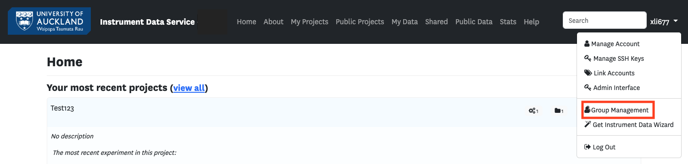
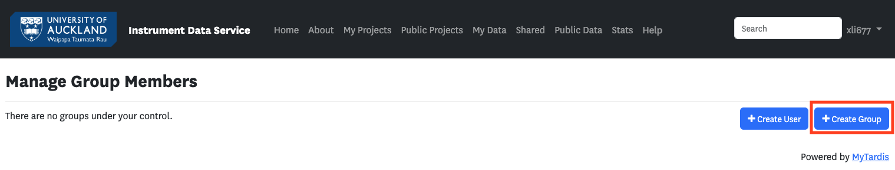
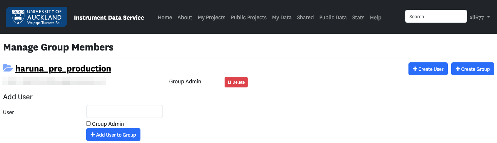
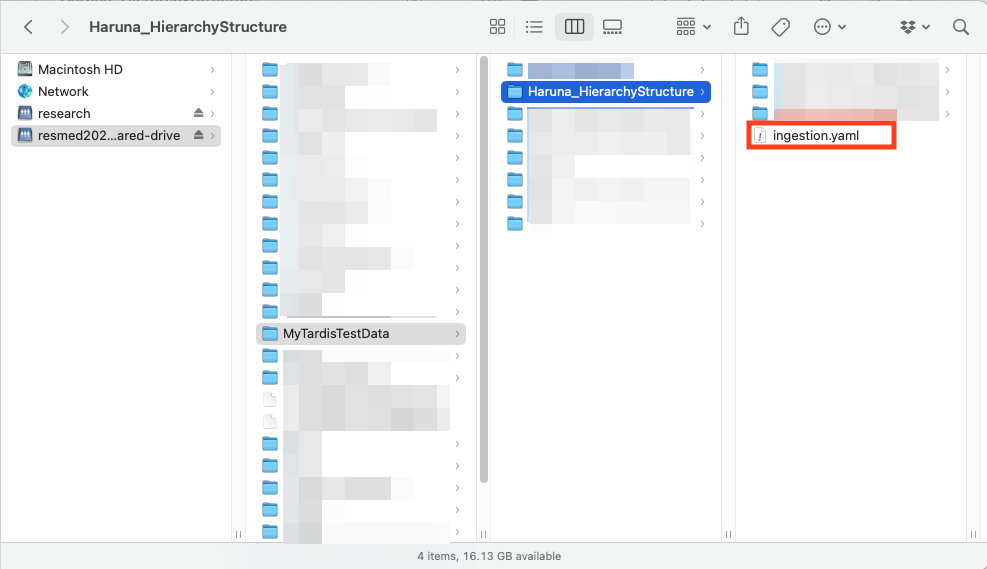

Instructions for Using the Instrument Data Service (IDS)
==============================================================

This document provides step-by-step instructions for using Instrument Data Service (IDS) and Instrument Data Wizard (IDW).

Log in to IDS
---------------------------------------------------

`Instrument Data Service (IDS) <https://instruments.nectar.auckland.ac.nz/>`_

- **Step 1:** Click "**Log In**" on the login page.

.. image:: instruction1.png

- **Step 2:** Complete the university's 2FA authentication.

.. image:: instruction2.png

.. image:: instruction3.png

Set up New Groups
-----------------

- **Step 1:** Once logged in, click your username in the top-right corner and select "**Group Management**", or go directly to the `Group Management page <https://test-instruments.nectar.auckland.ac.nz/group/groups/>`_ to set up new groups.

- **Step 2:** Click "**Create group**".

- **Step 3:** Enter the group name and the UPI of the group admin to create the group.

  .. note::

    You'll use the group name in the Instrument Data Wizard.

.. image:: instruction6.png

- **Step 4:** Add users to the group now or later as needed.

Download and Install the App
--------------------------------

- **Step 1:** Click your username in the top-right corner and select "**Get Instrument Data Wizard**".

.. image:: instruction8.png

- **Step 2:** Download the app for your operating system.

- **Step 3:** Run the app.
  
  - Unzip the downloaded file.
  - Put the `.exe` in a convenient location where you can easily find it, such as "My Documents".
  
  .. note::

    Admin rights are not required.

Organize Your Data
----------------------

- **Step 1:** Open the app.

  .. note::

    Your device needs **Java** installed for the automated metadata extraction feature to work. Please ensure a **Java JDK** is installed on your system. For Windows, search and install '**Corretto OpenJDK**' from the Software Centre.

  
- **Step 2:** Start adding projects, experiments, datasets, and files.

  .. note::

    If you are not familiar with Instrument Data Wizard, please follow the :ref: `../tutorial` for guidance.

.. image:: instruction11.png

Save Your Data
------------------

- **Step 1:** Once you have added all your data, save the ingestion file in the root of your data folder on the BIRU shared drive.

.. image:: instruction12.png

Notify Us
-------------

- **Step 1:** Inform us and provide the data location via email to |service_contact|.
  
  **Example of the data location:**

  - **For Windows:** ``\\files.auckland.ac.nz\research\resmed202000005-biru-shared-drive\<your-root-folder>``
  - **For Linux and Mac:** ``//files.auckland.ac.nz/research/resmed202000005-biru-shared-drive/<your-root-folder>``
  
- **Contact:** |service_contact| for assistance with IDS setup.