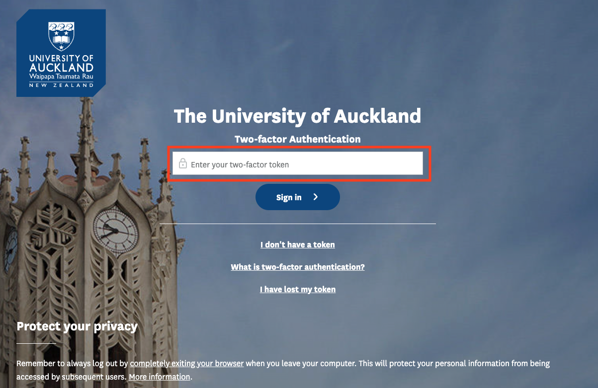
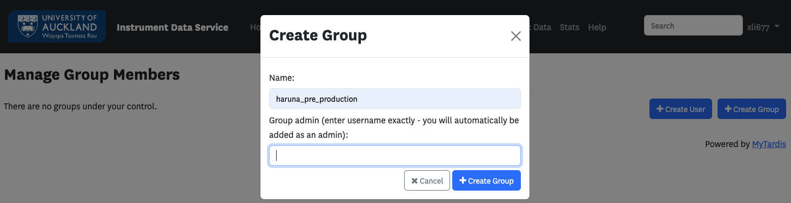
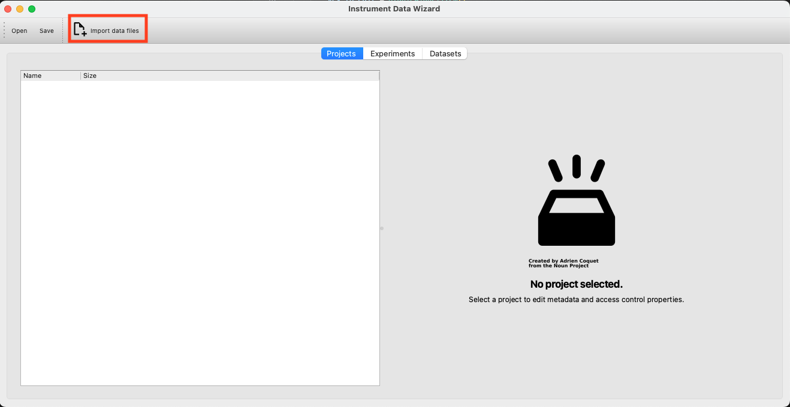
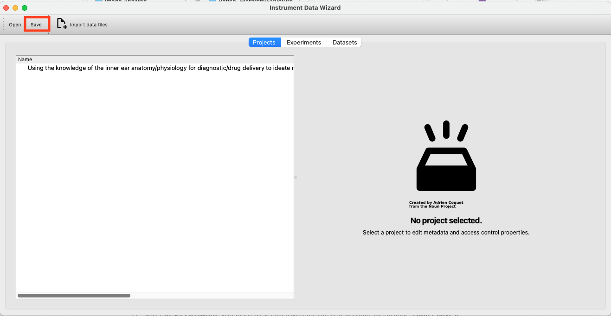

How to Get Your Data into IDS
=========================================================================================

This document provides step-by-step instructions to get your data into `Instrument Data Service (IDS) <https://instruments.nectar.auckland.ac.nz/>`_ using Instrument Data Wizard (IDW), including:

* :ref:`Log in to IDS`
* :ref:`Set up New Groups`
* :ref:`Download and Install IDW`
* :ref:`Organize Your Data`
* :ref:`Save Your Data`
* :ref:`Notify Us`

Log in to IDS
----------------------------------------------------------------------------------------

- **Step 1:** Click "**Log In**" on the login page.

.. image:: instruction1.png

- **Step 2:** Complete the university's 2FA authentication.

Set up New Groups
-----------------

- **Step 1:** Once logged in, click your username in the top-right corner and select "**Group Management**", or go directly to the `Group Management page <https://test-instruments.nectar.auckland.ac.nz/group/groups/>`_ to set up new groups.

.. image:: instruction4.png

- **Step 2:** Click "**Create group**".

.. image:: instruction5.png

- **Step 3:** Enter the group name and the UPI of the group admin to create the group.

  .. note::

    You'll use the group name in the Instrument Data Wizard.

- **Step 4:** Add users to the group now or later as needed.

.. image:: instruction7.png

Download and Install IDW
--------------------------------

Find instructions here: :ref:`download and run <download_and_run>`.

Organize Your Data
----------------------

- **Step 1:** Open the app.

  .. note::

    Your device needs **Java** installed for the automated metadata extraction feature to work. Please ensure a **Java JDK** is installed on your system. For Windows, search and install '**Corretto OpenJDK**' from the Software Centre.

.. image:: instruction10.png

  
- **Step 2:** Start adding projects, experiments, datasets, and files.

  .. note::

    If you are not familiar with Instrument Data Wizard, please follow the :ref:`tutorial <tutorial>` for guidance.

Save Your Data
------------------

- **Step 1:** Once you have added all your data, save the ingestion file in the **root** of your data folder on the BIRU shared drive.

.. image:: instruction13.png

Notify Us
-------------

- **Step 1:** Inform us and provide the data location to |service_contact|_ via email .
  
  **Example of the data location:**

  - **For Windows:** ``\\files.auckland.ac.nz\research\resmed202000005-biru-shared-drive\<your-root-folder>``
  - **For Linux and Mac:** ``//files.auckland.ac.nz/research/resmed202000005-biru-shared-drive/<your-root-folder>``
  
- For assistance with IDS setup and using IDW, please **Contact:** |service_contact|_.