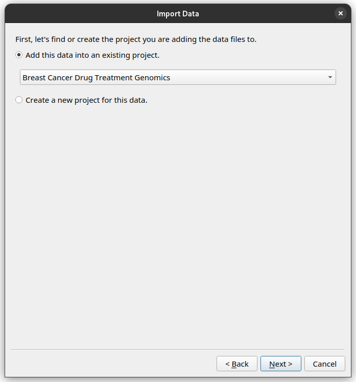

Tutotial
######################################

Before the tutorial
===================

Here, we'll guide you through the process of annotating a dataset using the Instrument Data Wizard, getting it ready for ingestion into |service_name|.

Imagine yourself in a fictional scenario: You're Sarah, a PhD student collecting data for your cancer genomics research, and you want to store this data in your University's instrument data repository.

In these two tutorials, we'll provide step-by-step instructions to help you annotate your data effectively no matter it's the first time or you are going to annotate new datasets to existing projects.

By the end of this tutorial, you will learn about the Instrument Data Wizard and |service_name|, and how to:

* download a YAML file for existing projects from |service_name|.
* import data files into the Instrument Data Wizard and add structure to it.
* annotate your data with metadata 
* restrict access to your data or subset of the data
* export the metadata

If you want to follow along on your computer, please install Instrument Data Wizard, download the tutorial data, and unzip it on your desktop. This data will be used in the rest of the tutorial.

:download:`Tutorial data for importing your first dataset into IDW <tutorial/tutorial-data-from-scratch.zip>`

:download:`Tutorial data for importing new datasets to your existing projects into IDW <tutorial/tutorial-data-existing-projects.zip>`

Contact |service_contact|_ if you need assistance getting set up on |service_name|.

Ready? Let's begin!

(Option 1) Import your first dataset into the Instrument Data Wizard
====================================================================

To import your data into the Instrument Data Wizard, open the Wizard and click the `Import data files` button.

.. image:: tutorial/import-1.png

A step-by-step wizard will show up, with the first page giving a brief introduction to the |service_name| hierarchy.

.. image:: tutorial/import-2.png

Add the first `Project`, `Experiment`, `Dataset` and `Datafiles`
----------------------------------------------------------------

Click *Next*. In the subsequent dialogs, the wizard will ask you where you would like to organise your data. Because we are starting with a blank metadata file, the wizard will ask you to create a new Project, Experiment and Dataset. 

In this tutorial, we have prepared the :code:`ingestion.yaml` for you in the tutorial data folder, so there is no need to download it. The file contains the metadata for your existing projects in |service_name|.

To get started, open the Wizard and click the `Open` button. Select the provided YAML file. Your projects from |service_name| will be listed.

.. image:: tutorial/metadata-4.png

The file includes one project called “Breast Cancer Drug Treatment Genomics” with ID “BREAST04”, one experiment named “Keytruda” with ID “Keytruda”, and one dataset named "Raw" with ID “Keytruda-Raw”.

To add new data, you can click the `Import data files` button, and the step-by-step wizard will prompt you to add files and ask how you would like to organise them.

You can also right-click on the `Project`, `Experiment` or `Dataset` you would like to add more data to, and select the `Add Experiment`, `Add Dataset` or `Add files` options.

As Sarah, you have some new raw data in the Herceptin trial you would like to import. 

After clicking the `Import data files` button and going through the initial explanation screen, you will now be presented with a choice to add files to an existing `Project`, or create a new `Project`. 

Since this is data for the same project, choose the "Breast Cancer Drug Treatment Genomics" `Project`.

Then proceed through the rest of the wizard using this setup.

* Create a new Experiment with name "Herceptin", and ID "Herceptin".
* Create a new Dataset with the name "Raw", and ID "Herceptin-Raw".
*  Data files: Add the :code:`.fastq` files in the tutorial data folder, under `tutorial/herceptin/`.

Once finished, your editor should look like this.

.. image:: tutorial/import-5.png

(Option 2) Import new datasets to your existing projects into the Instrument Data Wizard
========================================================================================

To add new data to your existing Projects, Experiments, and Datasets in |service_name|, you need to first download a YAML file from |service_name|. This YAML file will contain the necessary information for the existing objects and list your projects.

* Log in to the `Instrument Data Service <https://instruments.nectar.auckland.ac.nz/>`_ with 2 factor auth (2FA).
* Click your username on top right and go to "Get Instrument Data Wizard" page.

* Head to the 'Starter file' session and download the starter file :code:`ingestion.yaml`.

* Move the downloaded :code:`ingestion.yaml` file to the root folder of your data in the BIRU share drive.

In this tutorial, we have prepared the :code:`ingestion.yaml` for you in the tutorial data folder, so there is no need to download it. The file contains the metadata for your existing projects in |service_name|.

To get started, open the Wizard and click the `Open` button. Select the provided YAML file. Your projects from |service_name| will be listed.

.. image:: tutorial/metadata-4.png

The file includes one project called “Breast Cancer Drug Treatment Genomics” with ID “BREAST04”, one experiment named “Keytruda” with ID “Keytruda”, and one dataset named "Raw" with ID “Keytruda-Raw”.

To add new data, you can click the `Import data files` button, and the step-by-step wizard will prompt you to add files and ask how you would like to organise them.

You can also right-click on the `Project`, `Experiment` or `Dataset` you would like to add more data to, and select the `Add Experiment`, `Add Dataset` or `Add files` options.

As Sarah, you have some new raw data in the Herceptin trial you would like to import. 

After clicking the `Import data files` button and going through the initial explanation screen, you will now be presented with a choice to add files to an existing `Project`, or create a new `Project`. 

Since this is data for the same project, choose the "Breast Cancer Drug Treatment Genomics" `Project`.

Then proceed through the rest of the wizard using this setup.

* Create a new Experiment with name "Herceptin", and ID "Herceptin".
* Create a new Dataset with the name "Raw", and ID "Herceptin-Raw".
*  Data files: Add the :code:`.fastq` files in the tutorial data folder, under `tutorial/herceptin/`.

Once finished, your editor should look like this.

.. image:: tutorial/import-5.png

.. _add-more-data:

Add more data
=============

What if you have files you need to organise separately from the initial import? Or if you need to add more files into the same dataset? For example, you may wish to ingest more than one sample or instrument run data files.

You can click the `Import data files` button again, and the step-by-step wizard will prompt you to add files and ask how you would like to organise them.

You can also right-click on the `Project`, `Experiment` or `Dataset` you would like to add more data to, and select the `Add Experiment`, `Add Dataset` or `Add files` options.

As Sarah, you also have some raw data in the Herceptin trial you would like to import. 

After clicking the `Import data files` button and going through the initial explanation screen, you will now be presented with a choice to add files to an existing `Project`, or create a new `Project`. 

Since this is data for the same project, choose the "Breast Cancer Drug Treatment Genomics" `Project`.

Then proceed through the rest of the wizard using this setup.

* Create a new Experiment with name "Herceptin", and ID "Herceptin".
* Create a new Dataset with the name "Raw", and ID "Herceptin-Raw".
*  Data files: Add the :code:`.fastq` files in the tutorial data folder, under `tutorial/herceptin/`.

Once finished, your editor should look like this.

.. image:: tutorial/import-5.png

Save your progress
==================
Instrument Data Wizard keeps all your data structure and annotations in an YAML-formatted ingestion file. This file is read by the |service_name| ingestion process to find all your data files. It needs to be saved in the root folder of your data.

Click the `Save` button, and save your ingestion file under the tutorial data folder. Name it :code:`ingestion.yaml`. 

.. admonition:: Save as you go!
    
    Remember to save your changes as you work! As the Instrument Data Wizard is still being developed, bugs and crashes may happen at inopportune moments. After a crash, you can reopen the file using the `Open` button.

Exercise: Add even more data
============================

Try to re-create the hierarchy in the Instrument Data Wizard as described in the :ref:`example data structure plan <sample-data-structure-plan>`.

Once finished, your editor should look like this.

.. image:: tutorial/import-exercise.png

Annotate your data with metadata
================================
Now that your files are imported and organised, you can start annotating them.

Basic metadata fields
---------------------
In |service_name|, there is a basic set of metadata fields applicable for any `Projects`, `Experiments`, `Datasets` or `Datafiles`. They are fields like name, ID, author and institution.

Additional metadata with `Schemas`
----------------------------------
In addition, you can attach more metadata to a `Project`, `Experiment`, `Dataset` or `Datafile` through `Schemas`. They are made up of custom metadata fields called `Parameters`. You can specify the `Parameter` name and the value data type (for example, you can restrict the value to be a number, a string of characters, or a date.) 

`Schemas` need to be defined in |service_name| before you can use them in Instrument Data Wizard. 

A `Project`, `Experiment`, `Dataset` or `Datafile` can have multiple `Schemas` associated with them.

.. admonition:: What can I store in `Schemas`? 

    You can associate domain- or instrument- specific metadata with a `Project`, `Experiment`, `Dataset` or `Datafile` using `Schemas`. One way to use `Schema` could be to describe the study or treatment you have applied to the sample. Alternatively, you may wish to note down the instrument configuration used for acquiring data. For example, data from a sequencer may benefit from a `Schema` with depth of sequencing and sequencing method as `Parameters`.
    
    It's best to create a data dictionary document with your collaborators to specify what metadata should be stored. See :ref:`data-dictionary`. 
    
    As part of onboarding, |service_name| can support you in creating a data dictionary, and create any `Schemas` for your research group. Contact |service_contact|_ for more information.

In the Instrument Data Wizard, first select the `Project`, `Experiment`, `Dataset` or `Datafile` you wish to edit, then you can change metadata on the right-hand pane.

The `Description` tab contains the basic metadata fields, while the `Metadata` tab contains the `Schema` metadata fields.

At the moment, the Instrument Data Wizard accepts free-text `Parameter` names and values.

Recording Sarah's metadata
--------------------------
As Sarah, you have two things you need to include in the metadata. You need to note down the instrument the sequencing was done on, and the sequence depth used. In genetics, sequence depth measures the `completeness of the sequencing process <https://en.wikipedia.org/wiki/Coverage_(genetics)>`_. 

Adding the instrument ID
------------------------
To record the instrument, you first need to find the instrument's `persistent identifier (PID) <https://datascience.codata.org/articles/10.5334/dsj-2020-018>`_. For Sarah, the sequencing company has given her the ID "http://hdl.handle.net/21.T11998/0000-001A-3904-0".

.. admonition:: Where can I find my instrument's persistent identifier?
    
    You can log in to the |service_name| web portal to find the ID. See :ref:`finding-instrument-id`.

Instrument is a basic metadata field, so you can find it in the `Description` tab, as the `Instrument ID` field.

After filling out the field, the editor should look like this.

.. image:: tutorial/metadata-3.png

Adding the sequence depth
-------------------------
You have decided with your team that sequence depth should be recorded as a `Schema Parameter` on each `Experiment`, with the name `Depth of sequencing`, and value as an integer.

Try adding 100 as the sequence depth for the Herceptin `Experiment`. Once finished, your editor should look like this.

.. image:: tutorial/metadata-1.png

If you need to delete a `Parameter` row, select that row, then click the `Remove` button.

.. admonition:: Keep your `Schema` names and values consistent
    
    Record `Parameter` names and values consistently, using the same letter casing and units. This will help with finding your data in the future. For example, if you have a `Parameter` representing a length, decide on the name (e.g. "distance", no uppercase) and the value unit (e.g. millimetre), and use them consistently.

Exercise: Adding more metadata
------------------------------
1. `Lead Researcher` is another basic metadata field on `Projects`. Try adding yourself as the lead researcher in the `Project`, using Sarah's University username :code:`skau921`.

Your editor should look like this:

.. image:: tutorial/metadata-4.png

2. For the Herceptin experiment, there was an error in the sequencing process. You would like to mark it as inaccurate. Decide on how you would represent this, then annotate the experiment.

This is one way you may like to add this:

.. image:: tutorial/metadata-5.png

Restrict access to your data
============================
In the Instrument Data Wizard, you can define which users or groups of users have access to your data in the |service_name|. 

|service_name| has a cascading access control mechanism which allows you to apply restrictions on which users or groups of users can access a file or a group of files. Permissions granted at a higher level of the hierarchy will cascade down to all the files nested in it unless explicitly overridden.

Users must have an account created in |service_name| in order to access the data.

Exercise: Adding Restrictions on your own data
----------------------------------------------
Think about who needs to be able to access your data. What kind of access should they have? If there's a subset of the data that should be accessible to more or fewer people, how should they be organised?

Save the ingestion file
=======================
Once you are finished organising and annotating your data, you can save the ingestion file for the last time. Ensure to save the ingestion file in the **root** of your data folder.

Your data folder should look like this.

.. image:: tutorial/export-1.png

We are finished! When your data is copied and ingested into |service_name|, the ingestion file will be examined for a list of data files, how they should be structured, metadata associated with them, and access control properties. If there are any errors or validation problems in the process, you will be notified.

This is the end of this introductory tutorial. Please contact |service_name| for any further questions.