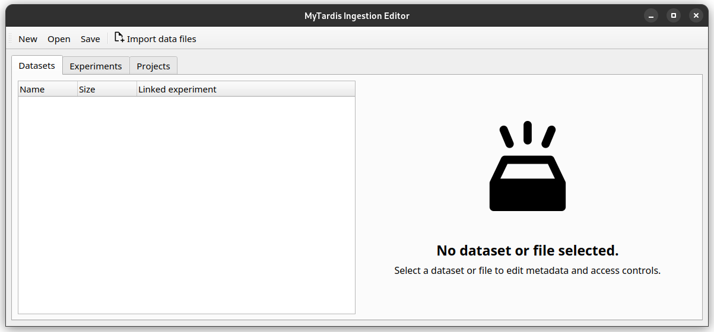
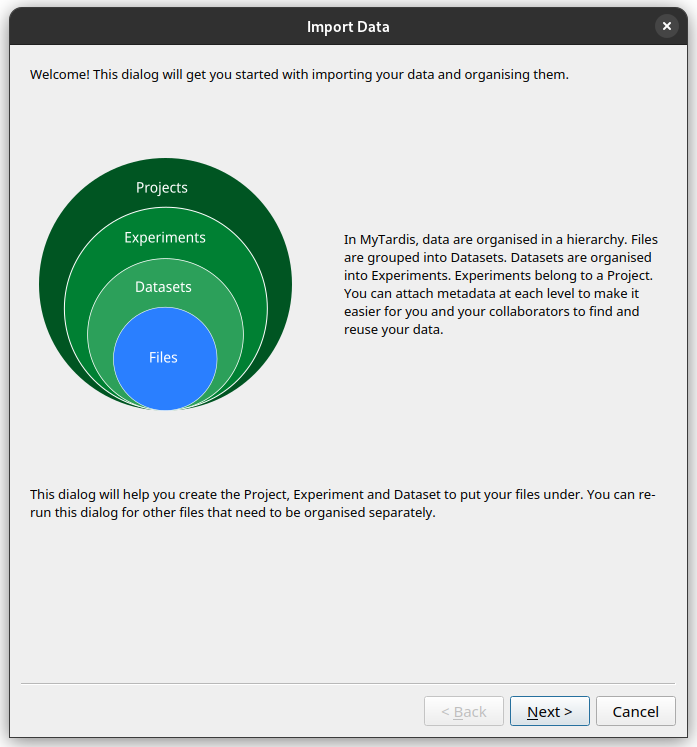
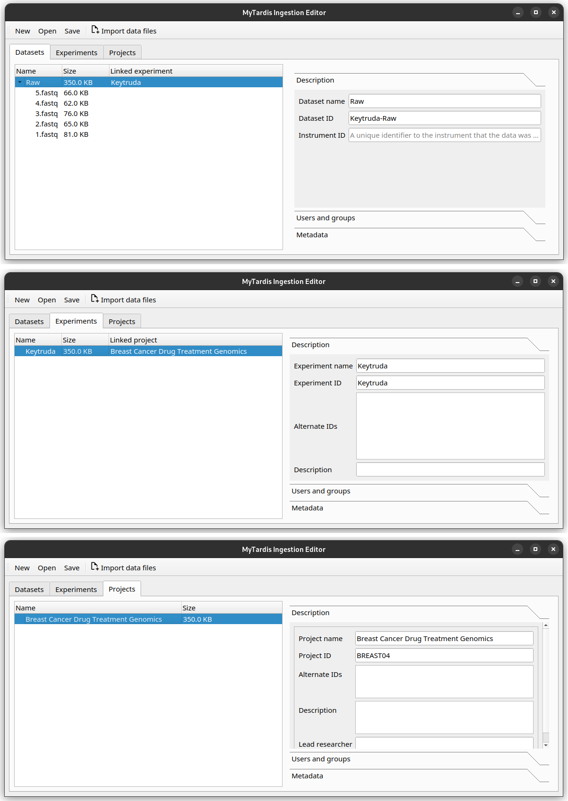
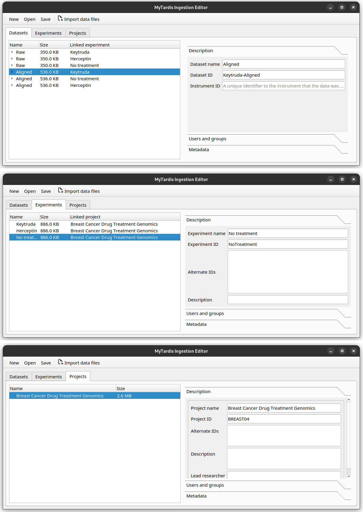

Import your data into the Instrument Data Wizard
================================================
To import your data into the Instrument Data Wizard, open the Wizard and click the `Import data files` button.
.. To import your data into the Instrument Data Wizard, you have a couple of options:

.. **Option 1**: Use a Template YAML file: If you already have a template YAML file downloaded from the `link <https://test-instruments.nectar.auckland.ac.nz/yaml/idw-yaml>`_ in |service_name| after logging in with 2FA, you can use it as a starting point for structuring your data.

.. Open the Wizard and click the `Open` button, select the downloaded YAML file, and click `Open`. Your projects from |service_name| will be listed.

.. **Option 2**: Start from scratch in IDW: Alternatively, you can create a new YAML file directly in the Instrument Data Wizard.

.. Open the Wizard and click the `Import data files` button.

A step-by-step wizard will show up, with the first page giving a brief introduction to the |service_name| hierarchy.

Add the first `Project`, `Experiment`, `Dataset` and `Datafiles`
----------------------------------------------------------------
Click *Next*. In the subsequent dialogs, the wizard will ask you where you would like to organise your data. Because we are starting with a blank metadata file, the wizard will ask you to create a new Project, Experiment and Dataset. 

As Sarah, you would like to import your raw data for the Keytruda trial. See if you can re-create this hierarchy in the Instrument Data Wizard:

* Project: Name: "Breast Cancer Drug Treatment Genomics", with ID "BREAST04".
* Experiment: Name: "Keytruda", with ID "Keytruda".
* Dataset: Name: "Raw", with ID "Keytruda-Raw".
* Data files: Add all the .fastq files in the tutorial data folder, under `tutorial-data/keytruda/`.

Once finished, your editor should look like this.

.. admonition:: What if I want to add data into an existing `Project` in the repository?

    If there is already a Project for your data in the data repository, you need to import it into the Instrument Data Wizard before you can start adding files to it. You can follow the instructions for :doc:`Adding data to existing Projects, Experiments or Datasets in the data repository <../adding-to-existing-structure>`.

.. _add-more-data:

Add more data
-------------
What if you have files you need to organise separately from the initial import? Or if you need to add more files into the same dataset? For example, you may wish to ingest more than one sample or instrument run data files.

You can click the `Import data files` button again, and the step-by-step wizard will prompt you to add files and ask how you would like to organise them.

You can also right-click on the `Project`, `Experiment` or `Dataset` you would like to add more data to, and select the `Add Experiment`, `Add Dataset` or `Add files` options.

As Sarah, you also have some raw data in the Herceptin trial you would like to import. 

After clicking the `Import data files` button and going through the initial explanation screen, you will now be presented with a choice to add files to an existing `Project`, or create a new `Project`. 

.. image:: import-4.png

Since this is data for the same project, choose the "Breast Cancer Drug Treatment Genomics" `Project`.

Then proceed through the rest of the wizard using this setup.

* Create a new Experiment with name "Herceptin", and ID "Herceptin".
* Create a new Dataset with the name "Raw", and ID "Herceptin-Raw".
*  Data files: Add the :code:`.fastq` files in the tutorial data folder, under `tutorial/herceptin/`.

Once finished, your editor should look like this.

.. image:: import-5.png

Save your progress
------------------
Instrument Data Wizard keeps all your data structure and annotations in an YAML-formatted ingestion file. This file is read by the |service_name| ingestion process to find all your data files. It needs to be saved in the root folder of your data.

Click the `Save` button, and save your ingestion file under the tutorial data folder. Name it "ingestion.yaml". 

.. admonition:: Save as you go!
    
    Remember to save your changes as you work! As the Instrument Data Wizard is still being developed, bugs and crashes may happen at inopportune moments. After a crash, you can reopen the file using the `Open` button.

Exercise: Add even more data
----------------------------

Try to re-create the hierarchy in the Instrument Data Wizard as described in the :ref:`example data structure plan <sample-data-structure-plan>`.

Once finished, your editor should look like this.

