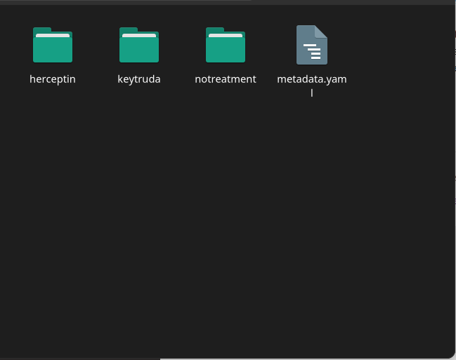

Save the ingestion file
=======================
Once you are finished organising and annotating your data, you can save the ingestion file for the last time. Ensure to save the ingestion file in the **root** of your data folder.

Your data folder should look like this.

We are finished! When your data is copied and ingested into |service_name|, the ingestion file will be examined for a list of data files, how they should be structured, metadata associated with them, and access control properties. If there are any errors or validation problems in the process, you will be notified.

This is the end of this introductory tutorial. Please contact |service_name| for any further questions.