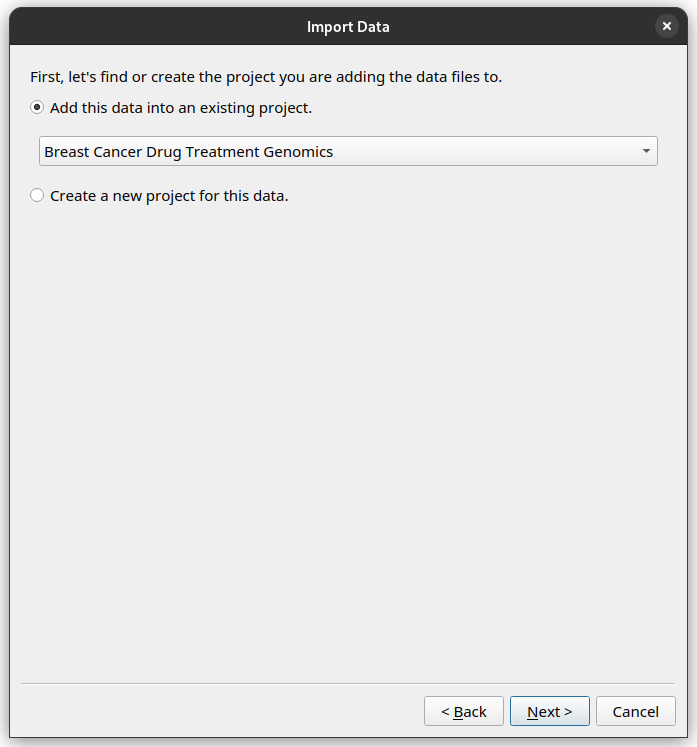

Import your data into the Instrument Data Wizard
================================================

To add new data to your existing Projects, Experiments, and Datasets in |service_name|, you need to first download a YAML file from |service_name|. This YAML file will contain the necessary information for the existing objects and list your projects.

* Log in to the `Instrument Data Service <https://test-instruments.nectar.auckland.ac.nz/>`_ with 2 factor auth (2FA).
* Point to this `download link <https://test-instruments.nectar.auckland.ac.nz/yaml/idw-yaml>`_. You will get a 'ingestion.yaml' dowloaded.
* Move the :code:`ingestion.yaml` file to the root folder of your data in the BIRU share drive.

In this tutorial, we have prepared the :code:`ingestion.yaml` for you in the tutorial data folder, so there is no need to download it. The file contains the metadata for your existing projects in |service_name|.

To get started, open the Wizard and click the `Open` button. Select the provided YAML file. Your projects from |service_name| will be listed.

.. image:: metadata-4.png

The file includes one project called “Breast Cancer Drug Treatment Genomics” with ID “BREAST04”, one experiment named “Keytruda” with ID “Keytruda”, and one dataset named "Raw" with ID “Keytruda-Raw”.

To add new data, you can click the `Import data files` button, and the step-by-step wizard will prompt you to add files and ask how you would like to organise them.

You can also right-click on the `Project`, `Experiment` or `Dataset` you would like to add more data to, and select the `Add Experiment`, `Add Dataset` or `Add files` options.

As Sarah, you have some new raw data in the Herceptin trial you would like to import. 

After clicking the `Import data files` button and going through the initial explanation screen, you will now be presented with a choice to add files to an existing `Project`, or create a new `Project`. 

Since this is data for the same project, choose the "Breast Cancer Drug Treatment Genomics" `Project`.

Then proceed through the rest of the wizard using this setup.

* Create a new Experiment with name "Herceptin", and ID "Herceptin".
* Create a new Dataset with the name "Raw", and ID "Herceptin-Raw".
*  Data files: Add the :code:`.fastq` files in the tutorial data folder, under `tutorial/herceptin/`.

Once finished, your editor should look like this.

.. image:: import-5.png

Save your progress
------------------
Instrument Data Wizard keeps all your data structure and annotations in an YAML-formatted ingestion file. This file is read by the |service_name| ingestion process to find all your data files. It needs to be saved in the root folder of your data.

Click the `Save` button, and save your ingestion file under the tutorial data folder. Use the same name :code:`ingestion.yaml`. 

.. admonition:: Save as you go!
    
    Remember to save your changes as you work! As the Instrument Data Wizard is still being developed, bugs and crashes may happen at inopportune moments. After a crash, you can reopen the file using the `Open` button.

Exercise: Add even more data
----------------------------

Try to re-create the hierarchy in the Instrument Data Wizard as described in the :ref:`example data structure plan <sample-data-structure-plan>`.

Once finished, your editor should look like this.

.. image:: import-exercise.png